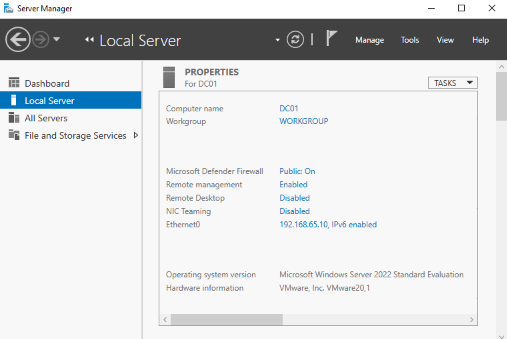
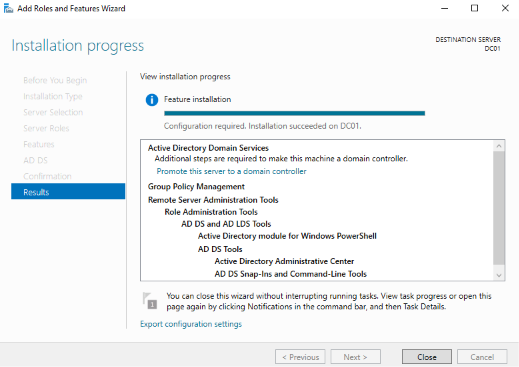
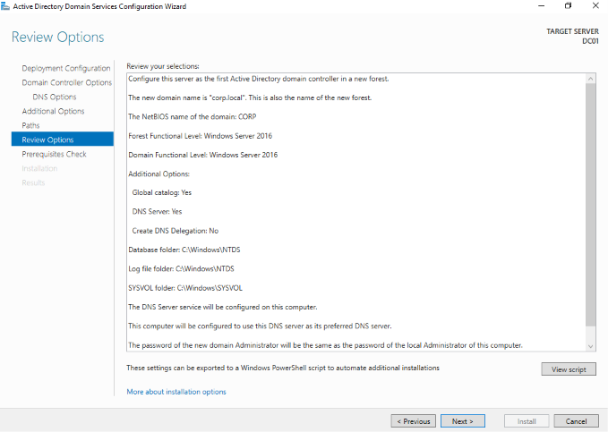
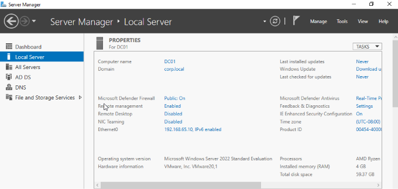
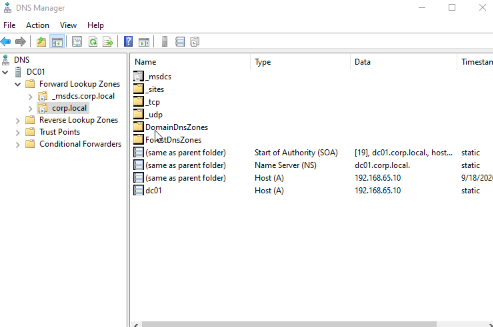
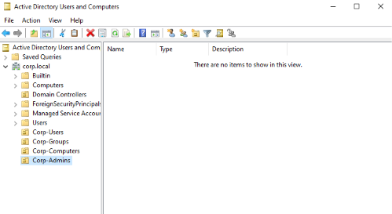
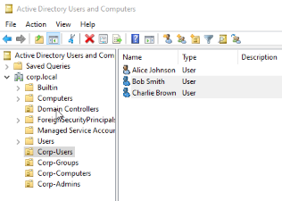
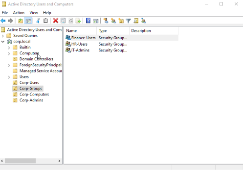
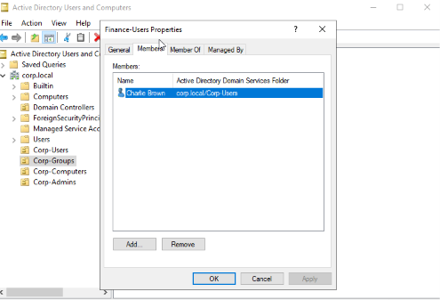

# Windows Server Active Directory Lab

## Overview

This project documents my hands-on experience building and configuring a Windows Server Active Directory environment using VMware Workstation.

The goal of the lab was to gain practical experience with Windows Server, Active Directory Domain Services (AD DS), DNS, organizational units, user accounts, and security group management.

## Lab Environment

- VMware Workstation
- Windows Server
- Active Directory Domain Services (AD DS)
- DNS
- Domain: `corp.local`
- Domain Controller: `DC01`

## What I Configured

### 1. Windows Server and Domain Controller
- Created a Windows Server virtual machine using VMware Workstation.
- Configured the server as `DC01`.
- Installed Active Directory Domain Services (AD DS).
- Promoted `DC01` to a domain controller.
- Created the `corp.local` Active Directory domain.

### 2. Active Directory and DNS
- Verified Active Directory functionality.
- Verified DNS configuration for the `corp.local` domain.

### 3. Organizational Units
Created OUs to organize Active Directory objects:

- `Corp-Users`
- `Corp-Groups`
- `Corp-Computers`
- `Corp-Admins`

### 4. Domain Users
Created domain user accounts inside the `Corp-Users` OU:

- Alice Johnson
- Bob Smith
- Charlie Brown

### 5. Security Groups
Created Global Security groups inside the `Corp-Groups` OU:

- `IT-Admins`
- `HR-Users`
- `Finance-Users`

Configured group membership to practice organizing users based on roles and access requirements.

## Skills Practiced

- Windows Server administration
- Active Directory Domain Services
- Domain controller configuration
- DNS
- Organizational Unit management
- User account administration
- Security group management
- Identity and access management fundamentals
- VMware virtualization

## Screenshots

### DC01 Server Setup
Configured the Windows Server virtual machine as DC01.

### Active Directory Domain Services
Installed Active Directory Domain Services (AD DS) on DC01.

### Domain Controller Configuration
Configured DC01 as the domain controller for the `corp.local` domain.

### DNS Verification
Verified DNS configuration and records for the `corp.local` domain.

### Organizational Units
Created OUs to organize users, groups, computers, and administrators.

### Domain Users
Created Alice Johnson, Bob Smith, and Charlie Brown in the `Corp-Users` OU.

### Security Groups
Created Global Security groups for IT, HR, and Finance.

### Group Membership
Assigned users to security groups to practice role-based organization and access management.

## Project Status

Completed the core Active Directory administration portion of the lab. Future improvements may include adding a domain-joined Windows client, Group Policy configuration, and additional security testing.
